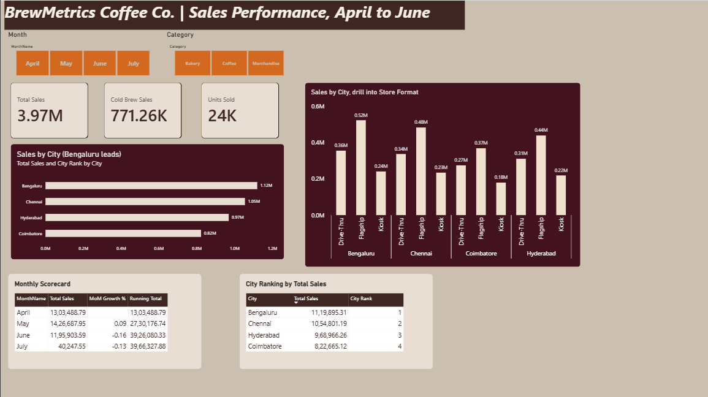
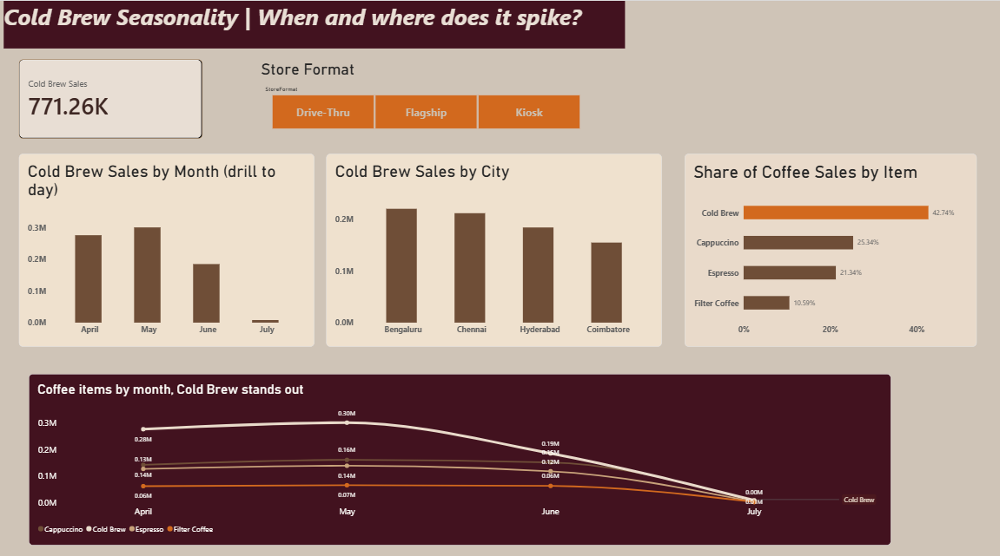

# BrewMetrics Coffee Co. — Business Intelligence Solution

A version-controlled Power BI solution (`.pbip`) that analyses BrewMetrics Coffee Co. sales across four cities and three store formats, with a focus on city performance and the seasonal Cold Brew pattern.

---

## 1. Project Overview

BrewMetrics Coffee Co. runs Flagship stores, Kiosks and Drive-Thrus across Bengaluru, Chennai, Hyderabad and Coimbatore. This project turns a flat transaction file (`brewmetrics_sales.csv`, about 15,500 rows) into a star-schema semantic model and a two-page dashboard.

The project is saved as a Power BI Project (TMDL format), so every change to the data model and report is tracked in Git: star schema first, then one DAX measure per commit, then the report, then the documentation.

**Source data:** April to June transactions, plus a single day of sales on 1 July (see [Known Limitations](#7-known-limitations)).

---

## 2. Data Model

The model is a star schema: one fact table and four dimension tables. Each relationship is one-to-many (dimension to fact) with single-direction filtering.

```
   Dim_City        Dim_StoreFormat      Dim_Product        Dim_Date
   (CityID)        (StoreFormatID)      (ProductID)        (Date)
       \                 |                   |                /
        \                |                   |               /
         +---------------+---------+---------+--------------+
                                   |
                              Fact_Sales
```

### Fact table

**`Fact_Sales`** holds one row per transaction.

| Column | Description |
|---|---|
| `sale_id` | Unique transaction identifier |
| `Date` | Transaction date (key to `Dim_Date`, hidden) |
| `CityID` | Key to `Dim_City` (hidden) |
| `StoreFormatID` | Key to `Dim_StoreFormat` (hidden) |
| `ProductID` | Key to `Dim_Product` (hidden) |
| `quantity` | Units sold in the transaction |
| `unit_price` | Price per unit |
| `sales_amount` | Revenue for the transaction (`quantity × unit_price`) |

### Dimension tables

| Table | Columns | Notes |
|---|---|---|
| `Dim_City` | `CityID`, `City` | 4 cities |
| `Dim_StoreFormat` | `StoreFormatID`, `StoreFormat` | 3 formats: Flagship, Kiosk, Drive-Thru |
| `Dim_Product` | `ProductID`, `Category`, `Item` | Categories: Coffee, Bakery, Merchandise |
| `Dim_Date` | `Date`, `Year`, `MonthNumber`, `MonthName`, `Day`, `WeekNumber` | Continuous calendar built in Power Query from the first to the last date in the data; marked as the date table; `MonthName` is sorted by `MonthNumber`; contains a `Date Hierarchy` (MonthName → Date) |

### Relationships

| From (one side) | To (many side) | Cardinality | Filter direction |
|---|---|---|---|
| `Dim_Date[Date]` | `Fact_Sales[Date]` | One-to-many | Single |
| `Dim_City[CityID]` | `Fact_Sales[CityID]` | One-to-many | Single |
| `Dim_StoreFormat[StoreFormatID]` | `Fact_Sales[StoreFormatID]` | One-to-many | Single |
| `Dim_Product[ProductID]` | `Fact_Sales[ProductID]` | One-to-many | Single |

---

## 3. DAX Measures

All measures live in the `Fact_Sales` table. Each was drafted with an AI assistant and tested in Power BI; the first suggestion and any corrections for each one are recorded in [NOTES.md](NOTES.md).

| Measure | Purpose |
|---|---|
| `Total Sales` | Sum of `sales_amount` |
| `MoM Growth %` | Percentage change in sales versus the previous month (month-over-month is used because the data covers a single year, so year-over-year is not possible) |
| `Running Total` | Cumulative sales across the dates in the current selection |
| `City Rank` | Ranks cities by `Total Sales` using `RANKX`, highest sales = rank 1 |
| `Cold Brew Sales` | Total sales for the Cold Brew item only |
| `Item Share of Category %` | An item's sales as a share of its category's sales (use with Category in the visual's context) |

The exact DAX for each measure is in the `.SemanticModel` folder (`definition/tables/Fact_Sales.tmdl`).

---

## 4. Dashboard

The report has two pages. A PDF export is included as `BrewMetrics_Dashboard.pdf`.

### Page 1: Overview
Answers: *How are we doing, and which cities lead?*

- **Slicers:** Month (`Dim_Date[MonthName]`) and Category (`Dim_Product[Category]`)
- **KPI cards:** Total Sales, Cold Brew Sales, Units Sold
- **Sales by City** (bar chart): `Total Sales` by city, with `City Rank` in the tooltip
- **Sales by City, drill into Store Format** (column chart): City → Store Format drill-down
- **Monthly Scorecard** (table): `Total Sales`, `MoM Growth %` and `Running Total` by month
- **City Ranking by Total Sales** (table): City, Total Sales and City Rank



### Page 2: Cold Brew Seasonality
Answers: *When and where does Cold Brew spike?*

- **Slicer:** Store Format
- **KPI card:** Cold Brew Sales
- **Cold Brew Sales by Month (drill to day):** column chart with a Month → Day drill-down using `Date Hierarchy`
- **Cold Brew Sales by City:** column chart
- **Coffee items by month:** line chart comparing Cold Brew with Cappuccino, Espresso and Filter Coffee
- **Share of Coffee Sales by Item** (stacked bar chart): Item Share of Category %, filtered to Coffee


---

## 5. Key Insights

Figures are read from the dashboard and rounded.

1. **Bengaluru leads on sales.** Bengaluru generated about 1.12M of the 3.97M total (roughly 28%), ahead of Chennai (1.05M), Hyderabad (0.97M) and Coimbatore (0.82M). The lead over Chennai is small (about 7%), while the gap to Coimbatore is large (about 37%).
2. **Flagship stores lead in every city.** Flagship accounts for about 1.81M (roughly 46% of sales), compared with about 1.28M for Drive-Thru and 0.87M for Kiosk. In Bengaluru alone, Flagship contributes about 0.52M of the city's 1.12M.
3. **Cold Brew is seasonal, peaking in April and May.** Cold Brew sales were about 0.28M in April and 0.30M in May, then fell to about 0.19M in June, a drop of roughly 37% from May. April and May together make up about three-quarters of its 771K total, and Cold Brew is about 19% of all sales. It is strongest in Bengaluru (about 0.22M).
4. **Overall sales rose, then fell.** Total sales were 13.03 lakh in April, rose about 9% in May (14.27 lakh) and fell about 16% in June (11.96 lakh).

---

## 6. Repository Contents

| File / folder | Description |
|---|---|
| `BI_MINI_Project.pbip` | Power BI Project file (open this) |
| `BI_MINI_Project.SemanticModel/` | Data model in TMDL: tables, relationships, measures |
| `BI_MINI_Project.Report/` | Report definition: pages and visuals |
| `brewmetrics_sales.csv` | Source data |
| `BrewMetrics_theme.json` | Custom coffee-colour theme |
| `BrewMetrics_Dashboard.pdf` | PDF export of the final dashboard |
| `NOTES.md` | Record of each DAX measure: AI first suggestion, corrections, final version |
| `REFLECTION.md` | Reflection on the AI-assisted, version-controlled workflow |

---

## 7. Known Limitations

- **Partial July.** The source file contains sales for only one day in July (1 July). Because `Dim_Date` is generated from the first to last date in the data, July appears in the Month slicer and scorecard. Its figures represent a single day, and its `MoM Growth %` should be ignored.
- **MoM Growth %** has no value for April, since there is no earlier month in the data.
- **Monthly comparisons are limited to one year** of data, so no year-over-year analysis is possible.

---

## 8. How to Open the Project

1. Install **Power BI Desktop** (a recent version).
2. Enable the project format: **File → Options and settings → Options → Preview features → Power BI Project (.pbip) save option**, then restart Power BI Desktop.
3. Clone or download this repository.
4. Open `BI_MINI_Project.pbip` in Power BI Desktop.

---

## 9. AI-Assisted Workflow

This project was developed with **Antigravity** as the AI coding assistant, used in place of GitHub Copilot because Copilot student verification was unavailable. Antigravity drafted the DAX measures and this README's first draft; every suggestion was tested against the data and corrected where needed. See [NOTES.md](NOTES.md) for the measure-by-measure record and [REFLECTION.md](REFLECTION.md) for the reflection.